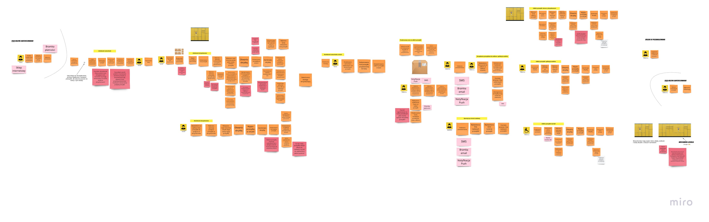

# Domain Explorers

Analiza domeny działania skrzynkomatów

## O repozytorium

Repozytorium założone w ramach uczestnictwa w projekcie [Domain Explorers](https://explorers.bettersoftwaredesign.pl).

## Analiza domeny

### Big Picture EventStorming

Link do pełnej wersji diagramu dostępny [tutaj](https://miro.com/app/board/o9J_lVITV9E=/). 
